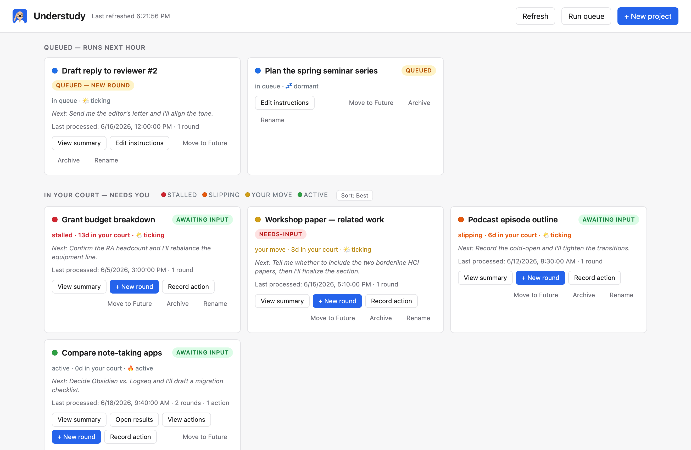

# understudy

*A calm, lightweight autonomous task queue for an LLM agent.*

Open a new project on a web app, send a Slack message, or drop a folder with an `instructions.md` into the queue. A headless agent picks it up, does the work — research, drafting, document analysis, real actions — and creates initial results and a plan you can review on a local web dashboard. You can keep working on the project, graduate it to a dedicated Claude Code session, archive it, or handle it in the future. If projects slug off, understudy tries to understand why and nudge you accordingly. 



*The dashboard, on demo data: every project at a glance — whose court the ball is in (health dot), how stale it is, the next step, and quick actions. Queued projects run next; processed ones wait for your input.*

Under the hood it's deliberately **not** a framework: no database, no message
broker, no web service to keep running, no DSL. The unit of work is just a folder,
and the state lives in Markdown and HTML you can read, edit, diff, and back up
with the tools you already have. The agent is whatever LLM CLI you point it at —
the orchestrator just shells out to a binary (set `CLAUDE_BIN`).

## How it works

You live in the **dashboard**; the folders are just how state is stored.

1. **Add work however's handy** — click **+ New project** in the dashboard, post
   in Slack, or drop a folder with an `instructions.md` under `Projects/`. All
   three create the same thing: a project folder whose `instructions.md` means
   "process me."
2. The **orchestrator** (`orchestrator.sh`) scans `Projects/` for folders with a
   live `instructions.md` and invokes the agent **once, headlessly**, with the
   queue mounted. When you add or update a project **from the dashboard** (new
   project, new round, edit instructions, record an action), the dashboard kicks
   off a drain for it **right away** — no waiting. Folders added another way
   (Finder, Slack/email intake) are picked up by an optional schedule (see below).
   Either way a present `.pause` suppresses automatic runs.
3. The **worker** processes each queued folder — reads any prior work, does the
   task, writes `SUMMARY.md` + `results.html` back into the folder (their presence
   = "processed"), and optionally posts a Slack notification.
4. On a clean run the orchestrator **archives** the instructions file
   (`instructions.processed-<timestamp>.md`) so the same ask doesn't re-trigger.
5. You **watch and steer from the dashboard** — a health light per project, the
   latest summary, the deliverable in one click, and buttons to queue a follow-up
   round, record a real-world action, rename, park, or archive.

Re-engaging a project is the same gesture from any door — a fresh `instructions.md`
(a Slack thread reply, a dashboard *New round*, or a dropped file) appends a new
"Round N" instead of starting over.

Under the hood, the queue is just a directory:

```
$QUEUE_ROOT/
├── orchestrator.sh        ← scans Projects/, invokes the agent once, headlessly
├── worker-prompt.md       ← the spec the headless agent reads
├── CLAUDE.md              ← architecture + the agent's operating manual
├── dashboard/             ← local web UI (Python stdlib, localhost only) — where you live
├── skills/slack-to-queue/ ← optional: turn Slack messages into queued projects
├── Projects/              ← ALL active projects live here (the only dir scanned)
│   ├── My first project/
│   │   ├── instructions.md   ← created via dashboard / Slack / a dropped file. = "process me"
│   │   ├── SUMMARY.md        ← agent writes this. its presence = "processed"
│   │   ├── results.html      ← agent writes this. the actual deliverable
│   │   └── (any inputs you drop in: PDFs, .docx, notes…)
│   └── _example/             ← a synthetic example to copy from
├── Future/                ← parked / someday projects (never scanned)
└── Archive/               ← wrapped-up projects (never scanned)
```

`Projects/`, `Future/`, and `Archive/` hold your data and are **gitignored**, so
they're never in the repo (only a synthetic `_example/` ships). Both
`orchestrator.sh` and the dashboard create any that are missing under
`$QUEUE_ROOT` on startup — a fresh clone or a brand-new queue root just works,
no manual `mkdir` needed.

## Design principles

- **One surface to watch.** You steer everything from the dashboard; the folder,
  Slack, and (optionally) email are interchangeable ways to feed it — no commands
  to learn.
- **Files are the database.** Everything is human-readable Markdown/HTML on disk.
  No hidden state. If the tooling vanished, your work would still be there.
- **Proportional, not enterprise.** Plain shell + Python stdlib + Markdown. No
  dependencies to chase.
- **Safe by default, powerful when you mean it.** A kill switch, optional
  per-project policy files, and a discipline of logging every external action.
  See [SECURITY.md](SECURITY.md).

## Safety model (read this before pointing it at a real account)

The worker can take **real actions** (send messages, write files, run web
research) because that's the point. Three controls sit on top:

1. **`.pause`** — a file at the queue root. If present, the orchestrator exits
   without doing anything. The kill switch.
2. **`POLICY.md`** — drop one into any project folder to narrow the agent's
   autonomy for that project ("draft only, never send", "read-only", etc.).
3. **Side-effect logging** — every action with consequences outside the folder
   must be recorded in `SUMMARY.md`. If it isn't logged, treat it as not done.

> ⚠️ The reference orchestrator runs the agent with permission prompts disabled
> (`--dangerously-skip-permissions`) so it can work unattended. That means **the
> agent acts with the full authority of whatever accounts you connect.** Connect
> least-privilege credentials, start with `POLICY.md: read-only` on new projects,
> and watch the logs until you trust it. Full details in
> [SECURITY.md](SECURITY.md).

## Quick start

**Easiest:** clone the repo, then ask your coding agent (Claude Code, Codex, …)
to *"set up Understudy"* — it follows [`SETUP.md`](SETUP.md) and configures
sorting and staleness thresholds (and optional nudges) with you, writing `.env`
and `config.json`.

Or do it by hand:

```bash
git clone <this repo> && cd understudy
cp .env.example .env             # then edit it
export QUEUE_ROOT="$(pwd)"       # simplest: use the repo itself as the queue root

./dashboard/start.sh             # opens http://127.0.0.1:8765 — your control surface
# In the dashboard, click "+ New project", give it a name and an instruction.
# (Same thing without the UI — just drop a folder:
#   mkdir -p "$QUEUE_ROOT/Projects/My first project"
#   echo "Summarize the attached PDF and list three open questions." \
#       > "$QUEUE_ROOT/Projects/My first project/instructions.md" )

./orchestrator.sh --dry-run      # see what's queued
./orchestrator.sh                # process it — results land back in the dashboard
```

`orchestrator.sh` requires `QUEUE_ROOT` and an LLM CLI on `CLAUDE_BIN` (defaults
to `~/.local/bin/claude`). The dashboard reads `QUEUE_ROOT` too, or falls back to
its own parent directory if the `dashboard/` folder lives inside the queue root.

### Scheduling (optional)

Work you add **from the dashboard** processes immediately (see "How it works"),
so a schedule is only needed to catch projects added **another way** — Finder
drops, or Slack/email intake. To process those on a schedule, point cron or a
launchd/systemd timer at `orchestrator.sh`, or use a session-only recurring
command in your LLM CLI. The `.pause` file neutralizes any scheduled run (and
dashboard auto-runs) without unscheduling it. If your queue lives under a
synced/cloud folder, the scheduling interpreter may need filesystem permission
to read it (e.g. Full Disk Access on macOS).

### Slack intake (optional)

`skills/slack-to-queue/` turns messages in a dedicated, single-member Slack
channel into queued projects (top-level message → new project; thread reply →
new round). Set `SLACK_CHANNEL_ID` and `SLACK_USER_ID` (see `.env.example`) and
wire the skill to your Slack MCP. Delete the folder if you don't want it.

An **email** door works the same way — a small intake step that turns messages in
a dedicated mailbox into queued projects — and is an easy addition (the same
pattern as the Slack intake; not bundled here).

## Related work / how this differs

Understudy is a deliberately *small, local-first, file-native* take on autonomous
agents. Compared to:

- **Heavier autonomous-agent frameworks** (AutoGPT/BabyAGI-style) — those keep
  state in their own runtime and chase a goal in a loop. Understudy keeps state in
  plain files on disk and runs the agent **once per drain**, so every result is a
  durable artifact you can read, diff, and back up.
- **Cron + a script** — that's essentially the engine here, but Understudy adds a
  durable project model (rounds, action debriefs, lessons), a safety posture
  (kill switch + per-project policy + side-effect logging), and a dashboard.
- **Hosted "custom agents" inside SaaS tools** — Understudy runs entirely on your
  machine against credentials you control; nothing leaves localhost except the
  agent's own web/MCP calls.

The pitch: if "a folder is a task and Markdown is the database" sounds right to
you, this is a complete, dependency-light implementation of that idea.

## License & attribution

MIT — see [LICENSE](LICENSE).

## Status

A personal tool, shared in case the pattern is useful. No warranty; expect to
read the code before trusting it with anything that can send messages.
